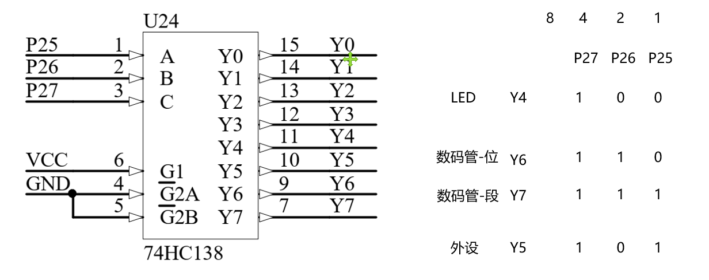
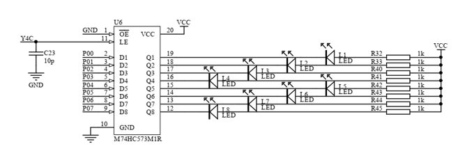
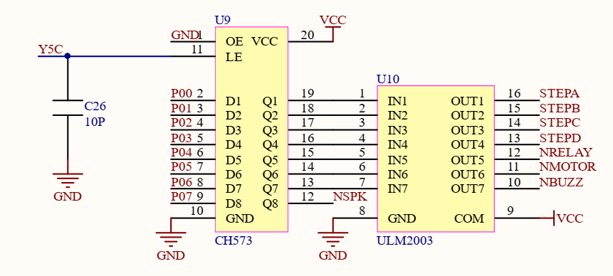

1.初始化程序

```c
#include "bsp_init.h"
//函数名：关闭外设初始化函数
//入口参数：要显示的十六位进制数据 0XAA=1010 1010
//返回值：无；
//函数功能：关闭蜂鸣器·LED等外设
void Cls_Peripheral(void)
{
    P0 = 0xFF;//将LED置位
    P2 = P2 & 0X1F | 0X80;//定位 Y4；
    P2 &= 0x1F;//关闭选通Y4 锁存器全部置0；
    P0 = 0x00;
    P2 = P2 & 0x1F | 0xA0; //选通Y5
    P2 &= 0x1F;
}


```



```
P0 = 0xFF;//关闭led灯（低电平触发）	

P2 = P2 & 0x1F | 0X80;//0x1F = 0001 1111；0X80 = 1000 0000
					  //(1)将P2端口初始化为0001 1111，即将高3位清零						
					  //(2)对清零后的高3位赋值，对应Y4 Y5 Y6 Y7
P2 &= 0x1F;//取消选定138译码器（000时不会选择外设）

P0 = 0x00;//关闭全部外设
P2 = P2 & 0x1F | 0xA0; //0x1F = 0001 1111；0xA0 = 1010 0000
					   //原理同上，将高三位清零后赋值，选择对应Y4 Y5 Y6 Y7
P2 &= 0x1F;////取消选定138译码器（000时不会选择外设）


```



