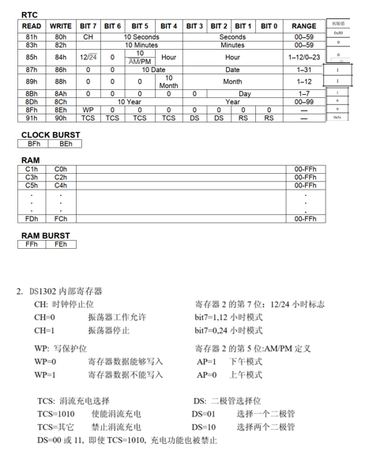

DS1302时钟设计

**编程思路：**




**驱动程序设计：**

```c
/*
  程序说明: DS1302驱动程序
  软件环境: Keil uVision 4.10 
  硬件环境: CT107单片机综合实训平台 8051，12MHz
  日    期: 2011-8-9
*/


#include <intrins.h>
#include "bsp_DS1302.h"

sbit SCK=P1^7;		
sbit SDA=P2^3;		
sbit RST = P1^3;   // DS1302复位												

void Write_Ds1302(unsigned  char temp) 
{
	unsigned char i;
	for (i=0;i<8;i++)     	
	{ 
		SCK=0;
		SDA=temp&0x01;
		temp>>=1; 
		SCK=1;
	}
}   

void Write_Ds1302_Byte( unsigned char address,unsigned char dat )     
{
 	RST=0;	_nop_();
 	SCK=0;	_nop_();
 	RST=1; 	_nop_();  
 	Write_Ds1302(address);	
 	Write_Ds1302(dat);		
 	RST=0; 
}

unsigned char Read_Ds1302_Byte ( unsigned char address )
{
 	unsigned char i,temp=0x00;
 	RST=0;	_nop_();
 	SCK=0;	_nop_();
 	RST=1;	_nop_();
 	Write_Ds1302(address);
 	for (i=0;i<8;i++) 	
 	{		
		SCK=0;
		temp>>=1;	
 		if(SDA)
 		temp|=0x80;	
 		SCK=1;
	} 
 	RST=0;	_nop_();
 	SCK=0;	_nop_();
	SCK=1;	_nop_();
	SDA=0;	_nop_();
	SDA=1;	_nop_();
	return (temp);			
}

//函数名：设置DS1302时分秒函数
//入口参数：数组
//返回值：无；
//函数功能：设置DS1302时分秒函数
void Set_Rtc(unsigned char* ucRtc)
{
	unsigned char temp;//中间局部变量， 存在时分秒
	Write_Ds1302_Byte(0x8E,0);//WP = 0;允许写操作

	
	temp = (((ucRtc[0]/10)<<4) | (ucRtc[0]%10));//数组的第0个数据，为小时
	Write_Ds1302_Byte(0x84,temp);//写入到小时的寄存器
	temp = (((ucRtc[1]/10)<<4) | (ucRtc[1]%10));//数组的第1个数据，为分钟
	Write_Ds1302_Byte(0x82,temp);//写入到分钟的寄存器
	temp = (((ucRtc[2]/10)<<4) | (ucRtc[2]%10));//数组的第2个数据，为秒
	Write_Ds1302_Byte(0x80,temp);//写入到秒的寄存器

	Write_Ds1302_Byte(0x8E,0x80);//WP = 1;不允许写操作
}

//函数名：读取DS1302时分秒函数
//入口参数：将读取到的时分秒数据保存到指针
//返回值：无；
//函数功能：读取DS1302时分秒函数，将读取到的数据放到数组指针指向的位置
void Read_Rtc(unsigned char* ucRtc)
{
	unsigned char temp;//中间局部变量， 存在时分秒
	temp = Read_Ds1302_Byte(0x85);//读取小时
	ucRtc[0] = (((temp>>4)*10) + (temp&0x0F));//23(BCD) = 0010 0011(B) = 35(D)  不能直接赋值，要进行BCD到十进制的转换
	temp = Read_Ds1302_Byte(0x83);//读取分钟
	ucRtc[1] = (((temp>>4)*10) + (temp&0x0F));//23(BCD) = 0010 0011(B) = 35(D)  不能直接赋值，要进行BCD到十进制的转换
	temp = Read_Ds1302_Byte(0x81);//读取秒
	ucRtc[2] = (((temp>>4)*10) + (temp&0x0F));//23(BCD) = 0010 0011(B) = 35(D)  不能直接赋值，要进行BCD到十进制的转换


}
```

**main.c**

```c
#include "bsp_init.h"
#include "timer.h"
#include "bsp_seg.h"
#include "stdio.h"
#include "bsp_key.h"
#include "bsp_DS1302.h"
#include "bsp_led.h"
//-------------------------------------
/* 函数声明 */
//三个主题循环，基本上永远不便
void Key_proc(void);//按键处理，底层数据变更
void Seg_proc(void);//显示处理，显示信息生成
void Led_proc(void);//Led处理，LED状态信息显示

/* 全局变量声明 */
unsigned int ms_count;
unsigned char s_count;//准备显示出来的是指

unsigned char seg_buf[8];//放置字符串转换后的段码到数组
unsigned char seg_string[10];//放置字符串
unsigned char pos = 0 ;//中断显示专用

unsigned char Key_Value;//读取按键
unsigned char Key_Down,Key_Old;// 读取按键的数值并储存变量

unsigned int Key_Slow_Down;//按键减速
unsigned int Seg_Slow_Down; //显示减速

unsigned char Running_State;//记录运行状态
unsigned char ucLed;//记录LED的状态信息

//DS1302专用。当使用DS1302时，基本永远不变
unsigned char ucRtc[3]={23,59,55};//数组初始值，里面放的是时分秒的数值
//-------------------------------------

void main()
{
	Cls_Peripheral();//关闭外设
	Timer1Init();//定时器1初始化，使能定时器1中断
	EA = 1;//打开总中断
	Set_Rtc(ucRtc);//设置Rtc时间
	while(1)
	{
		Key_proc();//按键处理，底层数据变更
		Seg_proc();//显示处理，显示信息生成
		Led_proc();//Led处理，LED状态信息显示
	}	
}

/* Timer1 interrupt routine */
void tm1_isr() interrupt 3
{
	if(++Key_Slow_Down == 10)
	 {
	  Key_Slow_Down = 0;//按键减速
	 }
	if(++Seg_Slow_Down == 500) 
	 {
		Seg_Slow_Down= 0; //显示减速
	 }

	 if(++ms_count == 1000)//记录运行时间
	 {
	 	s_count++;
		ms_count = 0;
	 }
    Seg_Disp(seg_buf,pos); //显示刷新
	pos++;

	if(pos == 8)
	{
		pos = 0;
	}

		if(Key_Down)//捕捉到下降沿跳变
	{
		if(++Running_State == 2)
		{
			Running_State = 0;//保证Running_State在01之间翻滚
		}
	}

	Led_Disp(ucLed);

}

//-----------------------------------------------

void Key_proc(void)//按键处理，底层数据变更
{
	if(Key_Slow_Down) 
	{
		return;
	}
	Key_Slow_Down = 1;	//减速程序
	Key_Value = Key_Read();//读取按键按下的编号
	Key_Down = Key_Value & (Key_Old^Key_Value);
	Key_Old = Key_Value;	
}
//-----------------------------------------------

void Seg_proc(void)//显示处理，显示信息生成
{
	 if(Seg_Slow_Down)
	 {
	 	return;
	 }
    
	 Seg_Slow_Down = 1;
    
	 switch(Running_State)
	 {
	 	case 0: 
		
			Read_Rtc(ucRtc);//读取1302内部时分秒的数据，放到预定义的数组空间中
	 		sprintf(seg_string,"%02d- %02d- %02d",(unsigned int)ucRtc[0],(unsigned int)ucRtc[1],(unsigned int)ucRtc[2]);
			break;

		case 1:sprintf(seg_string,"     %03d",(unsigned int)s_count);
			break;

	 }
	 
	Seg_Tran(seg_string,seg_buf);

}

void Led_proc(void)//Led处理，LED状态信息显示
{
	 switch(Running_State)
	 {
	 	case 0:
				ucLed = 0x0F;
				break;
		case 1: 
				ucLed = 0xF0;
				break;
	 }
}
```

